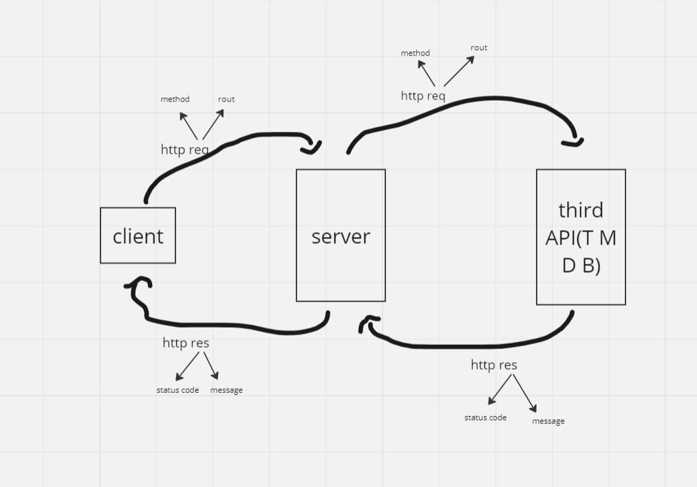

# Movie App - V1.0

**Balqees Hmoud**

## WRRC


## WRRC2


## Overview
The app provides a variety of movies and TV programming

## Getting Started
``` 1. clone the repository: git clne url```
 ```2. Open VS Code```
 ```Initialize the project: npm install```
 ```4. Run to Your server:node server.js ```

## Project Features
The app includes a diverse content library for movies and TV shows, easy-to-use navigation, secure account creation, seamless video streaming, offline viewing, basic content recommendations, search functionality, cross-platform compatibility, straightforward subscription management, and optional notifications. 