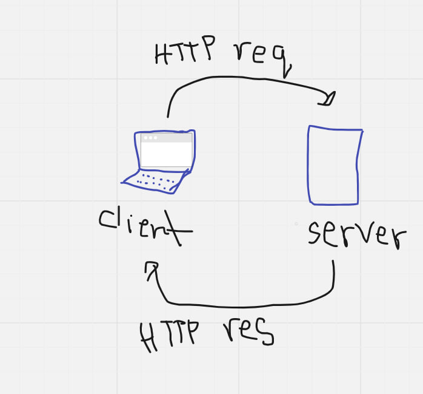

# Movie App - V1.0

**Balqees Hmoud**

## WRRC


## Overview
The app provides a variety of movies and TV programming

## Getting Started
``` npm init -y -y : yes```
 ```create index.js file , name is optional```
 ```npm install express to install express package to use it```
 ```run the server using node index.js```
 ```install nodemon npm install nodemon```

## Project Features
The app includes a diverse content library for movies and TV shows, easy-to-use navigation, secure account creation, seamless video streaming, offline viewing, basic content recommendations, search functionality, cross-platform compatibility, straightforward subscription management, and optional notifications. 